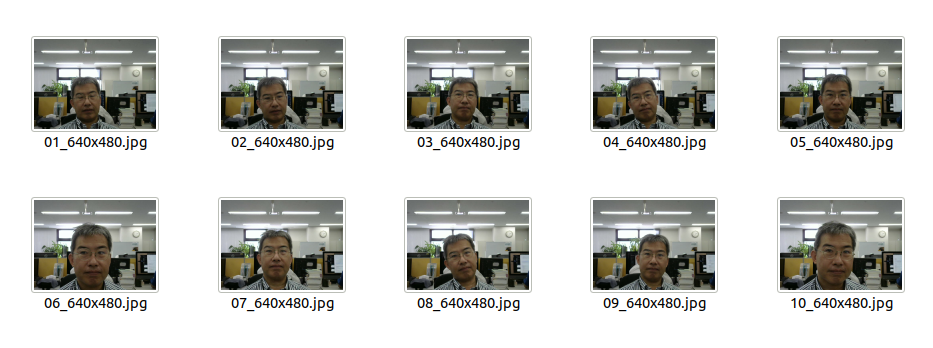
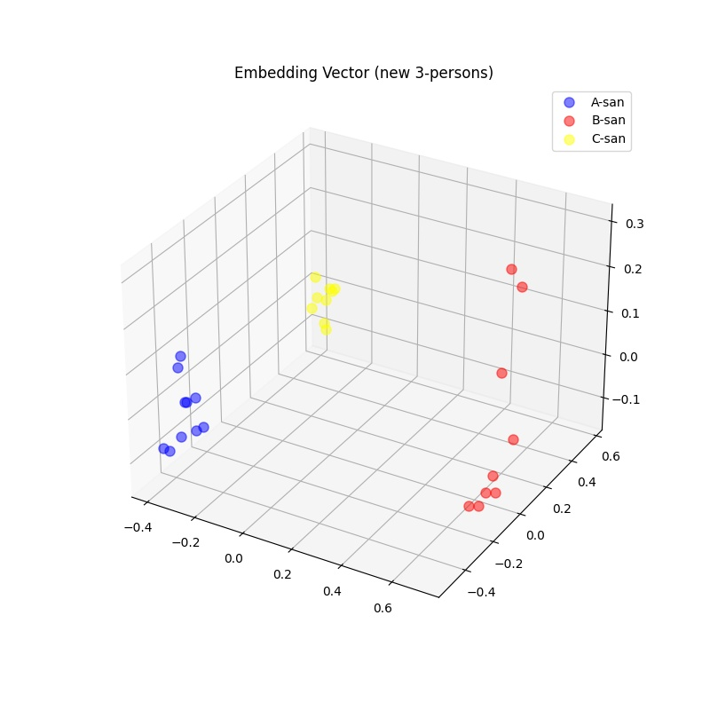
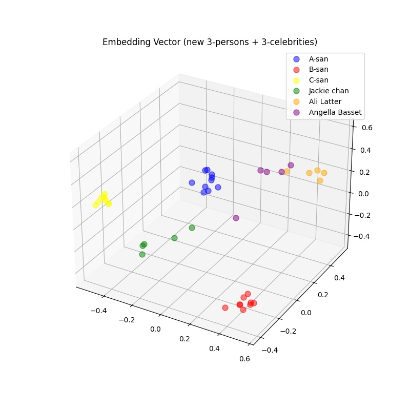

#Edge TPUで顔認証してみる～実装編その４（最終回）

##１．今回やること

[前回の記事（Edge TPUで顔認証してみる～実装編その３）](https://www.soliton-cyber.com/blog/edgetpu-facedetection-3)では、KerasモデルをEdgeTPU対応のTensorFlowLiteモデルに変換し、EdgeTPUに実装することができました。顔エンコーディング（Face Encoding）の結果、PCにおけるKerasモデルと同様に正しい埋め込みベクトルが出力されることを確認しました。ここまでサンプル画像としてセレブ画像を用いてきましたが、今回はカメラで撮った我々自身の顔画像を使って顔認証をテストします。また、写真１枚からの顔認証や人間が感じる「似ている」とFaceNetが判定する「似ている」の違いについても試してみました。

##２．カメラ画像による顔エンコーディング

###（１）サンプル画像取得プログラムを作る

カメラ画像から静止画を何枚か撮ろうと思うのですがこれがなかなか難しい。照明などの条件が悪いとブレブレの写真になってしまったり、撮影時間間隔が狭すぎると似たような写真のオンパレードになってしまいます。そこで以下のような仕様のコマンドを作ってみました。

```shell
$ ./facesampler.py --help
usage: facesampler.py [-h] [--images IMAGES] [--interval INTERVAL] [--laplacian LAPLACIAN] [--dryrun] [--frame] name

positional arguments:
  name                  target person's name               # 被写体になる人の名前
optional arguments:
  -h, --help            show this help message and exit
  --images IMAGES       number of capture images           # 取得する静止画の枚数（デフォルト：30[枚]）
  --interval INTERVAL   intarval time [sec]                # 撮影時間間隔[秒]（デフォルト：2[秒]）
  --laplacian LAPLACIAN laplacian threshold                # ラプラシアン分散閾値（デフォルト：800）
  --dryrun              run without saving files           # dry run：何も保存しない空実行
  --frame               save frames and create list        # 顔画像ではなく元画像を保存＆jsonリスト作成
```

このプログラムは何もオプション指定しなければ、2秒毎にカメラの静止画像をキャプチャーして30枚撮ると終了します。照明が足りなくて画像がブレがちの場合、ブレの少ない画像のみを選択するために「ラブラシアン分散閾値」を調整します。ラプラシアン分散値は撮影条件によって大きく異なり、値が大きいほどブレは少なくなります。しかしあまりにも大きな閾値を指定すると、ほとんどの画像がブレ画像であると判定されて、捨てられる画像が大部分になってしまうので適切な閾値を指定する必要があります。そこで、「--dryrun」オプションを使って何回かプログラムを空（から）実行して適切な閾値を決めます。プログラム実行の最後に以下のようなラプラシアン分散値の統計情報が出るのでこれを参考にしながら閾値を変えていきます。
```shell
$ ./facesampler.py --dryrun --laplacian 400 A-san
...
Elapased Time: 2.072
Discarded Frames: 49
Frame count: 30
Laplacian min: 84, max: 1453, mean: 710     ←ここを見る
$
```
ブレ画像対策の詳細については[[1]](https://qiita.com/goodboy_max/items/a2d5dd89c4c5a8f2308a)をご参照ください。


【facesampler.py】

```python
#!/usr/bin/env python3
# -*- coding: utf-8 -*-
import cv2
import sys
import os
import glob
import argparse
import time
import json

def face_detect(image, cascade):
    frameh = image.shape[0]
    framew = image.shape[1]

    # 顔検出チェック
    CROPPED_SIZE = (160, 160)
    image_gray = cv2.cvtColor(image, cv2.COLOR_BGR2GRAY)
    faces = cascade.detectMultiScale(image_gray, scaleFactor=1.1, minNeighbors=3, minSize=CROPPED_SIZE)
    if len(faces) == 0:                         # 検出なしなら次の画像読込みへ
        print("face detection failed")
        return None

    # マージン付き切取りチェック
    maxw = 0
    (x, y, w, h) = (0, 0, 0, 0)
    for face in faces:                          # 幅が一番大な領域を顔検出領域とする
        if face[2] > maxw:                      # face[2] => w
            (x, y, w, h) = face
            maxw = w

    margin = 10
    (top, right, bottom, left) = y - margin//2, x + w + margin//2, y + h + margin//2, x - margin//2
    if top < 0 or left < 0:                     # 切取り座標が負になれば次の画像読込みへ
        print("out of range: left=%d, top=%d" % (left, top))
        return None

    if bottom > frameh or right > framew:       # 切取り座標が元領域を超えれば次の画像読込みへ

        print("out of range: right=%d, bottom=%d" % (right, bottom))
        return None

    return  (top, right, bottom, left)

if __name__ == '__main__':
    # 引数処理
    parser = argparse.ArgumentParser()
    parser.add_argument("name", type=str, help="target person's name")
    parser.add_argument("--images", default=30, type=int, help="number of capture images")
    parser.add_argument("--interval", default=2, type=int, help="intarval time [sec]")
    parser.add_argument("--laplacian", default=800, type=int, help="laplacian threshold")
    parser.add_argument("--dryrun", action="store_true", help="run without saving files")
    parser.add_argument("--frame", action="store_true", help="save frames and create list")
    args = parser.parse_args()

    # 検エンジン初期化
    CASCADE_PATH = "opencv-4.2.0/data/haarcascades/haarcascade_frontalface_alt2.xml"
    cascade = cv2.CascadeClassifier(CASCADE_PATH)

    # カメラ画像読込み準備
    CAMERA_ID = 0
    cap = cv2.VideoCapture(CAMERA_ID)
    framew = cap.get(cv2.CAP_PROP_FRAME_WIDTH)
    frameh = cap.get(cv2.CAP_PROP_FRAME_HEIGHT)
    print("Frame Widts: %d, Frame Height: %d" %(framew, frameh))
    if not cap.isOpened():
        print("can not open camera.")
        sys.exit()

    # 顔画像保存ディレクトリ準備
    NAME = args.name
    SAMPLES_DIR = "samples"
    name_dir = os.path.join(SAMPLES_DIR, NAME)
    if not args.dryrun:
        if not os.path.exists(name_dir):                        # ディレクトリ作成
            os.makedirs(name_dir)
        for jpeg_file in glob.glob(name_dir + "/*.jpg"):        # 残置ファイル削除
            os.remove(jpeg_file)

    # カメラ画像取得ループ
    frame_count = 1
    discarded_count = 0
    laplacian_count = 0
    laplacian_min = 10000
    laplacian_max = 0
    laplacian_sum = 0
    start = time.time()
    while True:
        # カメラ画像１枚読込み
        ret, frame = cap.read()
        if not ret:
            print("can not read frame from camera.")
            sys.exit()

        # 顔検出判定
        ret = face_detect(frame, cascade)
        if ret is None:
            continue

        # 顔画像の切り出し
        (top, right, bottom, left) = ret
        frame_cropped = frame[top:bottom, left:right, :]

        # カメラ画像を検出BOX込みで表示
        frame_with_box = frame.copy()
        WINDOW_NAME = args.name
        cv2.rectangle(frame_with_box, (left, top), (right, bottom), (0, 255, 255), 2)
        cv2.putText(
            frame_with_box,
            text = str(frame_count),
            org = (left, top - 10),
            fontFace = cv2.FONT_HERSHEY_SIMPLEX,
            fontScale = 1.0,
            color = (0, 255, 255),
            thickness = 4,
            lineType = cv2.LINE_8
        )
        cv2.imshow(WINDOW_NAME, frame_with_box)

        # ピンぼけチェック
        LAPLACIAN_THRESHOLD = args.laplacian            # ラプラシアン閾値
        gray_cropped = cv2.cvtColor(frame_cropped, cv2.COLOR_BGR2GRAY)
        laplacian = cv2.Laplacian(gray_cropped, cv2.CV_64F)
        laplacian_sum += laplacian.var()
        laplacian_count += 1
        if laplacian_min > laplacian.var():
            laplacian_min = laplacian.var()
        if laplacian_max < laplacian.var():
            laplacian_max = laplacian.var()
        if laplacian.var() < LAPLACIAN_THRESHOLD:
            print("out of focus: laplacian=%d" % laplacian.var())
            continue

        # インターバル時間以内ならやり直し
        NUM_OF_INTERVAL_TIME = args.interval
        elapsed_time = time.time() - start
        if elapsed_time < NUM_OF_INTERVAL_TIME:
            discarded_count += 1
            continue
        start = time.time()
        print("Elapased Time: %.3f" % (elapsed_time))
        print("Discarded Frames: %d" % (discarded_count))
        discarded_count = 0

        # 顔画像の保存
        if not args.dryrun:
            if not args.frame:
                cropped_path = os.path.join( os.path.join(SAMPLES_DIR, NAME),
                                 "%02d_%03dx%03d.jpg" % (frame_count, right - left, bottom - top))
                cv2.imwrite(cropped_path, frame_cropped, [cv2.IMWRITE_JPEG_QUALITY, 100])
            else:
                frame_path = os.path.join( os.path.join(SAMPLES_DIR, NAME),
                                 "%02d_%03dx%03d.jpg" % (frame_count, framew, frameh))
                cv2.imwrite(frame_path, frame, [cv2.IMWRITE_JPEG_QUALITY, 100])

        # 既定の枚数を撮ったら終了
        NUM_OF_IMAGES = args.images                     # 保存写真枚数
        print("Frame count: %02d" % frame_count)
        frame_count += 1
        if frame_count > NUM_OF_IMAGES:
            break

        # キー入力「q」があれば途中で終了
        DELAY = 5                                       # 5ミリ秒待つ
        if cv2.waitKey(DELAY) & 0xFF == ord('q'):
            break

    # 後処理
    cv2.destroyWindow(WINDOW_NAME)
    print("Laplacian min: %d, max: %d, mean: %d" % (laplacian_min, laplacian_max, laplacian_sum/laplacian_count))

    # 画像リスト作成
    if args.frame and not args.dryrun:
        samples = []
        names = [f for f in os.listdir(SAMPLES_DIR) if os.path.isdir(os.path.join(SAMPLES_DIR, f))]
        for name in names:
            sample = {}
            sample['name'] = name

            images_dir = os.path.join(SAMPLES_DIR, name)
            sample['image_paths'] = [p for p in glob.glob(images_dir + "/*") if os.path.isfile(p)]
            samples.append(sample)
        with open('facesamples.json', mode='wt', encoding='utf-8') as file:
            json.dump(samples, file, ensure_ascii=False, indent=2)


```

###（２）サンプル画像を取得する

このコマンドを使って、わたくし（A-san）および同僚２名（B-san, C-san）の合計３名の元画像（フレーム画像）とjsonファイル（以下のようなフォーマット。埋め込みベクトル計算プログラムに渡す）を取得します。
```json
[
  {
    "name": "A-san",
    "image_paths": [
      "samples/A-san/01_640x480.jpg",
      ...
      "samples/A-san/10_640x480.jpg"
    ]
  },
  {
    "name": "B-san",
    "image_paths": [
    ...
```

「A-san」は10枚、「B-san」「C-san」は９枚のサンプル画像を取得し、合計28枚のサンプル画像を集めました。
なるべく多くの種類の顔画像が欲しいので、顔を傾けたり近付けたりなどの動作で変化を付けます。例えば「A-san」の画像は以下のような感じです（あんまり変化が無いかも）。

<center>

>図１：サンプル画像（A-san）
</center>

###（３）埋め込みベクトルを可視化する

上記のプログラムにてサンプル画像ファイルとjsonファイルを得たので、これを使って埋め込みベクトルを計算します。計算プログラムは[前回の記事（Edge TPUで顔認証してみる～実装編その３）](https://www.soliton-cyber.com/blog/edgetpu-facedetection-3)の「３．顔エンコーディング（Step4）／（２）エンコーディングプログラム」に記載のプログラムを用いました。
次に、埋め込みベクトルの分布表示は[前々回の記事（Edge TPUで顔認証してみる～実装編その２）](https://www.soliton-cyber.com/blog/edgetpu-facedetection-2)「５．埋め込みベクトルを可視化する／（１）埋め込みベクトル可視化プログラム」に記載のプログラムを用いました。

####まずは非セレブ３人の埋め込みベクトル分布を見る

非セレブ３人とは、前述の「A-san」「B-san」「C-san」の３名です。この３人の埋め込みベクトル分布を示すのが図２です。今回用いたFaceNetモデルの学習では絶対に使われることのなかった3人の顔画像ですが、綺麗に３グループに分離されています。これによって、FaceNetの高い汎化能力が垣間見られます。

<center>

>図２：非セレブ３人の埋め込みベクトル分布
</center>

####次に非セレブ３人＋セレブ３人の埋め込みベクトル分布を見る

上記の非セレブ３人に加えて、前回までの記事で用いたセレブ3人「Jackie chan」「Ali Latter」「Angella Basset」を加えた６人の埋め込みベクトル分布を示したのが図３です。非セレブ３人とは異なり、セレブ３人は今回使ったFaceNetモデルの学習に使われた可能性が高い３人です。非セレブ３人グループがセレブ３人のグループと重なるかを見たかったのですが、まずまず綺麗に分離されているようです。つまり、FaceNetは既に学習されている人のグループと重ならないように、未知のグループを埋め込みベクトル空間にうまく配置する能力を予感させます。もちろん、そう言い切るには学習済みの人すべてのグループについて同様なことを調べなければなりませんが、学習データを入手できない今となっては難しいかも。

<center>

>図３：非セレブ３人＋セレブ３人の埋め込みベクトル分布
</center>

>参考文献：  
>[1] [ピンボケ写真の判定方法](https://qiita.com/goodboy_max/items/a2d5dd89c4c5a8f2308a)  

##３．SVMによる顔分類（Step5）

ついに最終ステップまできました。顔分類は今カメラに写っている人の名前は何かを判定する処理です。これは、カメラで読み込んだ顔画像の埋め込みベクトルが図２で示されているような埋め込みベクトル空間でどのグループに近いかを判定する処理となります（図２は３次元空間ですが実際には128次元空間）。

###（１）SVM(Support Vector Machine)について

「ベクトル空間でどのグループに近いかを判定」は多クラス分類手法に含まれます。多クラス分類手法はいくつかありますが、ここでは広く用いられている線形SVM(Support Vector Machine)を使います。SVMでの多クラス分類器は以下の２種類に大別されます。

* 一対一分類器 (one-versus-one classifier) 
* 一対他分類器 (one-versus-the-rest classifier)

scikit-learnのSVM(SVC)はデフォルトで「一対一分類器」が用いられるので我々もそれに準じます。SVMは基本的に、入力データが「クラスα」に属するか「クラスβ」に属するかの二者択一の処理です。分類対象のクラスが例えばNクラスある場合、「一対一分類器」はNクラスからすべての２クラスの組を取り出し、各々の組に対して入力データがどちらに属するかを判定します。最終的には多数決でどのクラスに属するかを決定します。２クラスの取り出し方は「N(N-1)/2」通りあるので計算量はNの２乗のオーダーで増えていきます。

今回のテストでは3人（A-san→GroupAクラス, B-san→GroupBクラス, C-san→GroupCクラス）なので、クラス数は全部で３、クラスの組み合わせ数も全部で３です。したがって、図４に示すように３つの分類器を使ってカメラ画像由来の埋め込みベクトルが属するクラスを判定することになります。

<center>
")
>図４：一対一分類器 (one-versus-one classifier)
</center>

今回のテストではクラス数が３で済みましたが、クラス数が多くなる場合は計算量がリニアなオーダーでしか増えない「一対他分類器 (one-versus-the-rest classifier)」を使った方がいいかもしれません。詳細は[[2]](http://taustation.com/linear-model-multiclass-classification/)[[3]](https://qiita.com/hiro88hyo/items/683d7d9feab0f33d69ea)をご参照ください。

###（２）SVMモデルを作る

SVMも機械学習アルゴリズムのひとつなので「学習」が必要です。入力データは「A-san」「B-san」「C-san」の合計28個の埋め込みベクトルです。これは前章「２．カメラ画像による顔エンコーディング」で得られた埋め込みベクトルファイルを用います。たったの28個のデータではありますが、このデータを学習してSVMモデルを作成します。SVMでクラス判定するにはモデルオブジェクトとラベルオブジェクトの両方が必要なので、pickleファイルに保存して後ほど使います。

```python
#!/usr/bin/env python3
# -*- coding: utf-8 -*-
import json
import pickle
import numpy as np
from sklearn.svm import SVC
from sklearn.preprocessing import LabelEncoder

if __name__ == '__main__':
    # 埋め込みベクトルデータの読込み
    with open('embeddings_tpu.json', mode='rt', encoding='utf-8') as file:
        items = json.load(file)

    # SVM学習用データ作成
    labels = []
    embeddings = []
    for item in items:
        embeddings.append(item['embeddings'])
        labels.extend([item['name']]*len(item['embeddings']))

    # SVM学習＆モデル作成
    embeddings = np.concatenate(embeddings)
    encoded_label = LabelEncoder().fit(labels)
    y = le.transform(labels)
    svm_model = SVC(kernel='linear', probability=True).fit(embeddings, y)

    # SVMモデルおよびラベルデータの保存
    with open('svmtrain.pkl', mode='wb') as f:
        pickle.dump([svm_model, encoded_label], f, protocol=2)
```
以下は注釈です。
> * 6～7行目：EdgeTPUにてscikit-learnを「pip3」でインストールしようとすると失敗しますが、「apt」ではうまくいきます。「# apt install python3-sklearn」を試してみてください。

> * 11行目：embeddings_tpu.jsonファイルは「A-san」「B-san」「C-san」の埋め込みベクトルファイルです。

> * 19行目：埋め込みベクトル数分（ここでは28個）のラベル名配列を作ります。[A-san,...,A-san,B-san,...,B-san,C-san,...,C-san]みたいな感じ。

> * 24行目：ラベルを文字列から整数値に変換します。

> * 25行目：カーネルに「linear」を指定しているので、線形SVMとなります。

###（３）リアルタイム顔認証してみる

SVMによる名前判定（クラス判定）の準備もできたので、最終的な目標であるリアルタイム顔認証をしてみます。プログラムは以下の通りで、今まで出てきたプログラムの集大成といった感じです。

```python
#!/usr/bin/env python3
# -*- coding: utf-8 -*-
import cv2
import sys
import time
import pickle
import numpy as np
from skimage.transform import resize
from edgetpu.basic.basic_engine import BasicEngine

def face_detect(image, cascade):
    ...(前のプログラムと同じ)

if __name__ == '__main__':
    # 顔推論エンジン初期化
    MODEL_PATH = "facenet_keras_edgetpu.tflite"
    engine = BasicEngine(MODEL_PATH)

    # 検エンジン初期化
    CASCADE_PATH = "haarcascade_frontalface_alt2.xml"
    cascade = cv2.CascadeClassifier(CASCADE_PATH)

    # SVMモデルロード
    SVM_MODEL_PATH = "svmtrain.pkl"
    with open(SVM_MODEL_PATH, 'rb') as f:
        svm_model, encoded_label = pickle.load(f)

    # カメラ画像読込み準備
    CAMERA_ID = 1
    cap = cv2.VideoCapture(CAMERA_ID)
    framew = int(cap.get(cv2.CAP_PROP_FRAME_WIDTH))
    frameh = int(cap.get(cv2.CAP_PROP_FRAME_HEIGHT))
    print("Frame Widts: %d, Frame Height: %d" %(framew, frameh))
    if not cap.isOpened():
        print("can not open camera.")
        sys.exit()

    # カメラ画像ループ
    while True:
        # カメラ画像１枚読込み
        ret, frame = cap.read()
        if not ret:
            print("can not read frame from camera.")
            sys.exit()

        # 顔検出判定
        ret = face_detect(frame, cascade)
        if ret is None:
            continue

        # 顔画像の切り出しとリサイズ
        (top, right, bottom, left) = ret
        image_cropped = frame[top:bottom, left:right, :]
        size = (160, 160)
        image_resized = resize(image_cropped, size, mode='reflect')

        # 顔画像の正規化
        mean = np.mean(image_resized, axis=(0, 1, 2), keepdims=True)
        std = np.std(image_resized, axis=(0, 1, 2), keepdims=True)
        std_adj = np.maximum(std, 1.0/np.sqrt(image_resized.size))
        image_whiten = (image_resized - mean) / std_adj
        image_whiten = np.expand_dims(image_whiten, axis=0)

        # 顔画像の量子化
        image_whiten = image_whiten.flatten()
        real_value_min = image_whiten.min()
        real_value_max = image_whiten.max()
        quantized_value_min = 0
        quantized_value_max = 255
        quantized_value_zero = 128
        scale = (quantized_value_max - quantized_value_min) / (real_value_max - real_value_min)
        image_quantized = image_whiten * scale + quantized_value_zero
        image_quantized = image_quantized.astype(np.uint8)

        # 埋め込みベクトル計算
        start = time.time()
        latency, embedding = engine.run_inference(image_quantized)
        elapsed_time = time.time() - start
        print("Embedding generate time：{:.6f}".format(elapsed_time) + "[sec]")
        print("Inference Latency：{:.6f}".format(latency) + "[ms]")

        # 埋め込みベクトル正規化
        EPSILON = 1e-10
        embedding = embedding / np.sqrt(np.maximum(np.sum(np.square(embedding), axis=0, keepdims=True), EPSILON))

        # SVM判定
        start = time.time()
        label_index = svm_model.predict([embedding])
        label_name = encoded_label.inverse_transform(label_index)
        probs = svm_model.predict_proba([embedding])
        elapsed_time = time.time() - start
        print("Embedding select time：{:.6f}".format(elapsed_time) + "[sec]")

        # カメラ画像を検出BOX込みで表示
        WINDOW_NAME = "Face Recognition"
        cv2.rectangle(frame, (left, top), (right, bottom), (0, 255, 255), 2)
        cv2.putText(
            frame,
            text = "%s (%.2f[%%])" % (label_name[0], probs[0][label_index[0]] * 100),
            org = (left, top - 10),
            fontFace = cv2.FONT_HERSHEY_SIMPLEX,
            fontScale = 0.7,
            color = (0, 255, 255),
            thickness = 2,
            lineType = cv2.LINE_8
        )
        cv2.imshow(WINDOW_NAME, frame)

        # キー入力「q」があれば途中で終了
        DELAY = 5                                       # 5ミリ秒待つ
        if cv2.waitKey(DELAY) & 0xFF == ord('q'):
            break

    # 後処理
    cv2.destroyWindow(WINDOW_NAME)
```
以下は注釈です。
> * 8行目：EdgeTPUにてscikit-imageを「pip3」でインストールしようとすると失敗しますが、「apt」ではうまくいきます。「# apt install python3-skimage」を試してみてください。

> * 26行目：前節「（２）SVMモデルを作る」で作られたpickleファイルから、SVMモデルオブジェクトとラベルオブジェクトを読み込みます。

> * 90行目：ターゲットが予測されたクラスに属する確率を0～1の実数で表します。

実行中の動画が図５です。この動画で撮影されたフレーム画像（顔検出に成功したもの）は116枚でした。誤検出は１枚も無し。名前判定確率の平均は81.57%、埋め込みベクトルの計算時間は平均42.1[ms]、名前判定（SVM計算）時間は平均5.2[ms]でした。名前判定時間は３名しかいないので早くて当然ですし、誤検出がゼロなのも当然の結果と思われます。

ともあれ、これでEdgeTPUでのリアルタイム顔認証はほぼ実現できました。

<center></center>
><center>図５：カメラ映像での顔認識（SVM方式）</center>

>参考文献：  
>[2] [線形モデルによる多クラス分類](http://taustation.com/linear-model-multiclass-classification/)  
>[3] [機械学習のアルゴリズム（2クラス分類から多クラス分類へ）](https://qiita.com/hiro88hyo/items/683d7d9feab0f33d69ea)  


##４．写真１枚からの顔分類

前章では3人のうちの誰かを判定するテストでしたので、まあ、これはどんな方法でも良い結果は得られそうです。もっと、数百人規模の中から誰かを判定するくらいでないと威力が感じられないですね。ならば、数百人分のフレーム画像データを集めればよいのですが、その労力たるやブログ記事を書くための下準備の範疇を遙かに越えてしまいます。しかし、幸運なことに社員数百人分の写真（1人あたり1枚！）ならなんとか入手できることがわかりました。これを使ってなんとかならないか。

###（１）Few-shot Learningというのがあるらしい

機械学習といえば普通は大量のデータを学習するものですが、現実にはそれが難しい場合も多いです。クラス分類問題ではクラス数は膨大でも各クラスについてのデータはちょっぴりというのがザラにあります。今回我々が試みるのは「各クラスについてのデータがちょっぴり」どころか「各クラスについてのデータが１つだけ」です。

ところがこういったことへの需要は多いらしく、機械学習には「Few-shot Learning」とか「One-shot Learning」という分野が存在します。詳細については[[4]](https://qiita.com/ell/items/9e9de65521c8b935d28f) をご覧ください。この記事の中の「[4.2.2 タスク不変の埋め込みモデル](https://qiita.com/ell/items/9e9de65521c8b935d28f#422-%E3%82%BF%E3%82%B9%E3%82%AF%E4%B8%8D%E5%A4%89%E3%81%AE%E5%9F%8B%E3%82%81%E8%BE%BC%E3%81%BF%E3%83%A2%E3%83%87%E3%83%AB-task-invariant-embedding-model)」が我々のやろうとしていることに近そうです。図６にこの記事の図を転載します。

<center></center>
><center>図６：タスク不変の埋め込みモデルによるFSL問題の解決</center>

どうやら、FaceNetを使っていることで既に「Few-shot Learning」に片足を突っ込んでいるようですが、One-shotについての具体的な答は無いようです。

###（２）埋め込みベクトルの「近さ」を検証する

図６の「Similarity S」の算出は自分で考える必要があります。１クラスあたりの学習データが10個くらいでもあればSVMやK近傍法を使うこともできますが、データが1個しかないのであればもはや埋め込みベクトルの距離を直接測るしかなさそうです。一番距離の短い埋め込みベクトルを持つ人が一番似ている人ですが、本人と他人でどれくらい距離が離れているかを調べてみました。

1. まず、ターゲット画像としてA-san、B-san、C-sanのカメラ画像を各々１枚、合計３枚を用意します。次にリファレンス画像として社員写真721人分の画像、合計721枚を用意します。
2. 次に１で用意された画像の埋め込みベクトルをすべて求めます。これはいつものやり方ですのでプログラムは載せません。
3. ターゲット画像の埋め込みベクトル（3個）とリファレンス画像すべての埋め込みベクトル（721個）とのユークリッド距離を計算します。
4. ターゲット画像の埋め込みベクトル毎に、３で得られた距離を昇順にソートして距離が短い順に距離の値を10個並べます。

図７は埋め込みベクトル距離計算の模式図です。

<center></center>
><center>図７：埋め込みベクトル距離計算</center>

図８は上記手順４をグラフ化したものです。このグラフは単に距離を並べたもので、ターゲット毎に短い距離に相当する人は異なります。
このグラフでわかることは以下の通り。

* 1位つまり正解と、2位以下の距離は大きく異なる
* ２位以下では距離に大きな差は無い

一番目の特徴から、１番短い距離のベクトルを選択するという単純な方法（最短距離方式とでも名付けておきます）でも、それなりのマージンを期待できます。二番目の特徴は少々意外だったのですが、埋め込みベクトルが128次元という高次元ベクトルなので、所謂「次元の呪い」が影響しているかと思います。「次元の呪い」はデータの次元数が高次元になると、データが空間の外側に集中して分布する現象で、任意の点からの最近傍点と最遠傍点との差が0に近づくそうです。詳しくは[[5]](https://qiita.com/tn1031/items/96e7131cd41df1aebe85)をご覧ください。

<center></center>
><center>図８：近距離ベスト10</center>

###（３）最短距離方式でリアルタイム顔認証してみる

最短距離方式を組み込んだリアルタイム顔認証プログラムです。SVM方式のプログラムとの違いはわずかですが全文載せておきます。

```python
#!/usr/bin/env python3
# -*- coding: utf-8 -*-
import cv2
import sys
import time
import pickle
import numpy as np
from skimage.transform import resize
from edgetpu.basic.basic_engine import BasicEngine

def face_detect(image, cascade):
    ...(前のプログラムと同じ)

if __name__ == '__main__':
    # 顔推論エンジン初期化
    MODEL_PATH = "facenet_keras_edgetpu.tflite"
    engine = BasicEngine(MODEL_PATH)

    # 検エンジン初期化
    CASCADE_PATH = "haarcascade_frontalface_alt2.xml"
    cascade = cv2.CascadeClassifier(CASCADE_PATH)

    # リファレンス埋め込みベクトルロード
    REFERENCE_PATH = "oneshot_encodings_tpu.json"
    with open(REFERENCE_PATH, mode='rt', encoding='utf-8') as rf:
        references = json.load(rf)

    # カメラ画像読込み準備
    CAMERA_ID = 1
    cap = cv2.VideoCapture(CAMERA_ID)
    framew = int(cap.get(cv2.CAP_PROP_FRAME_WIDTH))
    frameh = int(cap.get(cv2.CAP_PROP_FRAME_HEIGHT))
    print("Frame Widts: %d, Frame Height: %d" %(framew, frameh))
    if not cap.isOpened():
        print("can not open camera.")
        sys.exit()

    # カメラ画像ループ
    while True:
        # カメラ画像１枚読込み
        ret, frame = cap.read()
        if not ret:
            print("can not read frame from camera.")
            sys.exit()

        # 顔検出判定
        ret = face_detect(frame, cascade)
        if ret is None:
            continue

        # 顔画像の切り出しとリサイズ
        (top, right, bottom, left) = ret
        image_cropped = frame[top:bottom, left:right, :]
        size = (160, 160)
        image_resized = resize(image_cropped, size, mode='reflect')

        # 顔画像の正規化
        mean = np.mean(image_resized, axis=(0, 1, 2), keepdims=True)
        std = np.std(image_resized, axis=(0, 1, 2), keepdims=True)
        std_adj = np.maximum(std, 1.0/np.sqrt(image_resized.size))
        image_whiten = (image_resized - mean) / std_adj
        image_whiten = np.expand_dims(image_whiten, axis=0)

        # 顔画像の量子化
        image_whiten = image_whiten.flatten()
        real_value_min = image_whiten.min()
        real_value_max = image_whiten.max()
        quantized_value_min = 0
        quantized_value_max = 255
        quantized_value_zero = 128
        scale = (quantized_value_max - quantized_value_min) / (real_value_max - real_value_min)
        image_quantized = image_whiten * scale + quantized_value_zero
        image_quantized = image_quantized.astype(np.uint8)

        # 埋め込みベクトル計算
        start = time.time()
        latency, embedding = engine.run_inference(image_quantized)
        elapsed_time = time.time() - start
        print("Embedding generate time：{:.6f}".format(elapsed_time) + "[sec]")
        print("Inference Latency：{:.6f}".format(latency) + "[ms]")

        # 埋め込みベクトル正規化
        EPSILON = 1e-10
        embedding = embedding / np.sqrt(np.maximum(np.sum(np.square(embedding), axis=0, keepdims=True), EPSILON))

        # 最短距離ベクトル判定
        start = time.time()
        distance_min = 10.0
        name = ""
        for reference in references:
            reference_embedding = reference['embeddings'][0]
            distance = np.linalg.norm(embedding - reference_embedding)
            if distance < distance_min:
                name = reference['name']
                distance_min = distance
        elapsed_time = time.time() - start
        print("Embedding select time：{:.6f}".format(elapsed_time) + "[sec]")

        # カメラ画像を検出BOX込みで表示
        WINDOW_NAME = "Face Recognition"
        cv2.rectangle(frame, (left, top), (right, bottom), (0, 255, 255), 2)
        cv2.putText(
            frame,
            text = name,
            org = (left, top - 10),
            fontFace = cv2.FONT_HERSHEY_SIMPLEX,
            fontScale = 0.7,
            color = (0, 255, 255),
            thickness = 2,
            lineType = cv2.LINE_8
        )
        cv2.imshow(WINDOW_NAME, frame)

        # キー入力「q」があれば途中で終了
        DELAY = 5                                       # 5ミリ秒待つ
        if cv2.waitKey(DELAY) & 0xFF == ord('q'):
            break

    # 後処理
    cv2.destroyWindow(WINDOW_NAME)
```
以下は注釈です。
> * 24行目：読み組むファイルは721人分の埋め込みベクトルが記述された埋め込みベクトルjsonファイルです。フォーマットはいつものものと同じです。

> * 88行目：埋め込みベクトルは正規化されて長さが１になっています。データは128次元の超球面上にあるのでその直径＝2を越えることはありません。ここでは2より大きい数値ならなんでもいいです。

> * 92行目：ここでユークリッド距離を計算します。

実行中の動画が図９です。この動画で撮影されたフレーム画像（顔検出に成功したもの）は52枚でした。誤検出は１枚のみ。顔を横に向けた一瞬「K08_N0632」さんの名前が表示されます。埋め込みベクトルの計算時間は平均42.4[ms]、名前判定（最短距離計算）時間は平均107.6[ms]でした。

SVM方式に比べて名前判定に20倍以上の時間がかかっていますが、SVM方式のときは3人、最短距離方式では721人の判定を行っているのでこれくらいの違いは当然と言えるかもしれません。それにしても、埋め込みベクトル計算時間＋最短距離計算時間で150[ms]ほどかかっているので１秒間に６枚程度の画像しか表示できず、図９の動画でも動きがカクカクしています。

とは言え、写真１枚からでもこれだけ顔認識できるのですからFaceNetの能力はたいしたものです。

<center></center>
><center>図９：カメラ映像での顔認識（最短距離方式）</center>

>参考文献：  
>[4] [Few-shot Learningとは何なのか【Generalizing from a few examples: A survey on few-shot learning】](https://qiita.com/ell/items/9e9de65521c8b935d28f)  
>[5] [次元の呪いについて](https://qiita.com/tn1031/items/96e7131cd41df1aebe85)  

##５．人間とFaceNetの「似ている」の違いについて

ちょっとした興味から、人間が感じる「似ている」とFaceNetが判定する「似ている」の違いについても調べてみました。調査方法は以下の通り。

1. ある人にリファレンス画像（721人の写真）の中から、似ている人同士の組み合わせ（類似組）を51組選んでもらいます。
2. 類似組が例えばAさんとBさんだったすると、Aさんとリファレンス画像のすべての人との距離を計算します。
3. 計算した距離を昇順に（距離が短い順に）ソートして、Bさんがその中で何番目（何位）になるかを見つけます。これを類似組の順位とします。
4. Bさんが上位（＝類似組が上位）であるほど、FaceNetと人間の「似ている度」が近いことになります。

51組の類似組が何位であったかをヒストグラム表示したのが図１０です。ざっと見た感じでは、類似組は50位以内に入っているものが多く、その中でも10位以内に入っているものが多数を占めます。これは相当程度、FaceNetと人間の「似ている度」が近いと言えると思います。

人間が「似ている」と判定するには、画像の明暗に関する情報だけではなく、「頑固そう」とか「二枚目」とか「まん丸っぽい」とか画像から想起される感情的な評価によっても判定が左右されるので、FaceNetの結果とは異なって当然です。しかし、それを考慮してもFaceNetの判定が人間の判定とよく似ているのには驚きました。

<center></center>
><center>図１０：類似組順位ヒストグラム</center>


##６．おわりに

今回の記事をもって、「EdgeTPUで顔認証してみる」シリーズは完結しようと思います。EdgeTPUの登場からかなり時間も経ってしまい、シーンは盛り下がっている感も無きにしも非ずで、少々ネタが古くなってしまったかと反省しております。これからのネタは、FaceNet自体に素晴らしい印象があるので、軽量FaceNetモデル等FaceNet自体を掘り下げる方向とか、ArcFace等のモダンな深層距離学習とか、転移学習とかいろいろ考えられます。まあ、おいおい手を付けていきたいと思います。
